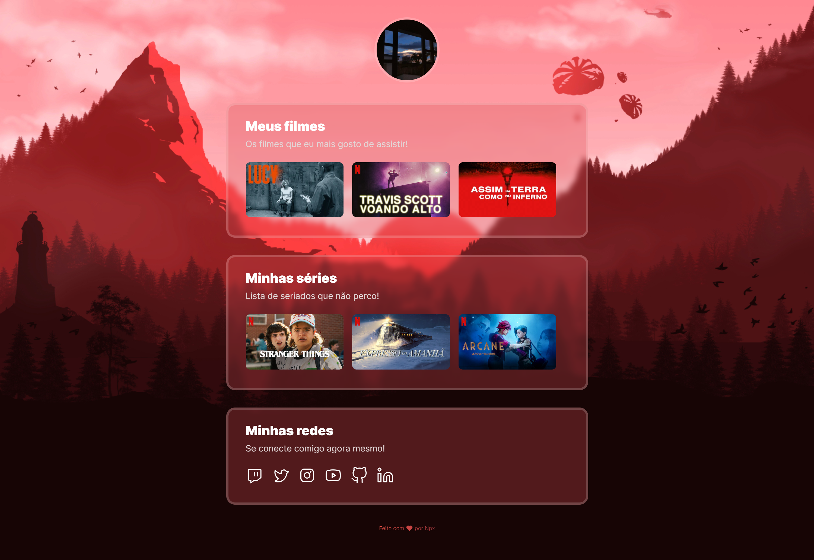

<h1 align="center">
  
</h1>

  

## 🚀 Tecnologias

Esse projeto foi desenvolvido com as seguintes tecnologias:

- HTML
- CSS

## 💻 Projeto

NLW eSports é um projeto voltado para a conexão entre gamers.

Você pode visualizar o projeto em funcionamento através do link abaixo:

- **[NLW eSports](https://gonlwesports.vercel.app/)**

## 🔖 Layout

Você pode visualizar o layout do projeto através [desse link](https://www.figma.com/community/file/1102912263666619803). É necessário ter conta no [Figma](https://figma.com) para acessá-lo.

---

Este projeto foi desenvolvido durante a **[Next Level Week eSports](https://nextlevelweek.com/)**, realizada pela **[@Rocketseat 💜](https://github.com/Rocketseat)**.
